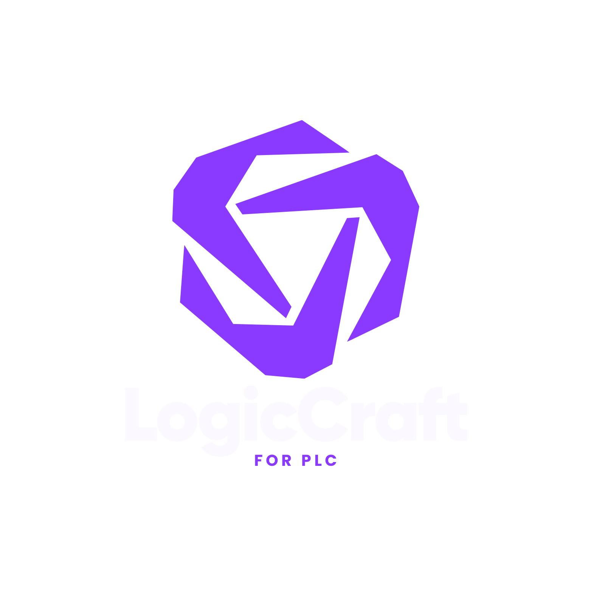
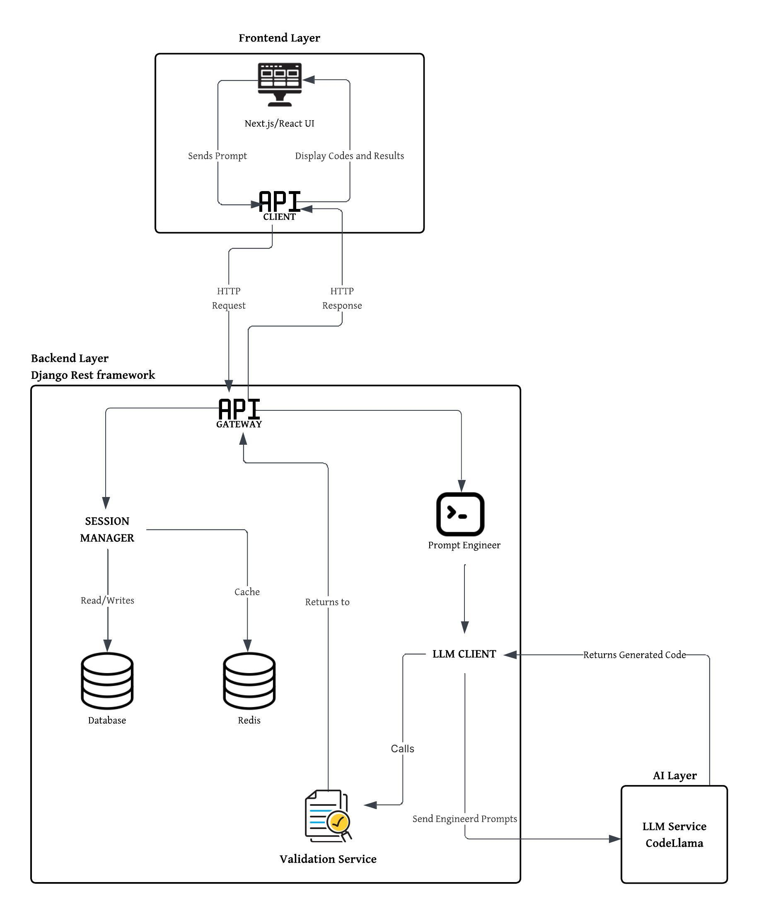

# LogicCraft - Project Documentation
<p align="center">
  
</p>

---

## Overview
ABB Code Assistant is a full-stack, production-grade platform for conversational code generation and validation, powered by advanced LLMs (Large Language Models). It enables users to interact naturally with an AI to generate, refine, and validate code, with session-based memory for multi-turn conversations.

---

## Architecture

### 1. Backend (logiccraft_backend)
- **Framework:** Django REST API
- **Features:**
  - Session-based conversational memory (multi-turn, context-aware code generation)
  - Code validation
  - PostgreSQL for persistent storage
  - Caching for repeated prompts
- **Key Files:**
  - `api/models.py`: Defines `Session` and `ConversationHistory` models for session memory.
  - `api/services.py`: Handles session creation, history storage/retrieval, code generation, and validation.
  - `api/views.py`: API endpoints for code generation, validation, and session-based conversation.
  - `api/admin.py`: Registers models for Django admin.
  - `logiccraft_backend/settings.py`: Configures PostgreSQL and environment variables.

### 2. LLM Service (LLM/ai-service)
- **Purpose:** Hosts and serves the LLM (e.g., CodeLlama) via an API endpoint.
- **Integration:** Backend calls this service to generate code from prompts.

### 3. Frontend (ABB_FrontEnd)
- **Framework:** Next.js + React + Tailwind CSS
- **Features:**
  - Natural language input for prompts
  - Display of generated code and validation results
  - Session management for multi-turn conversations
  - Modern, responsive UI

---

## Novel Points & Specialities
- **Session-Based Memory:** Enables natural, multi-step code refinement and context retention for each user.
- **Pluggable LLM Backend:** Easily swap or upgrade LLM models without changing the frontend or main backend logic.
- **Full Stack Integration:** Seamless communication between frontend, backend, and LLM service.
- **Production-Ready:** Secure, scalable, and extensible architecture with PostgreSQL and Django REST.

---

## How to Run

### 1. LLM Service
- Build and run the Docker container in `LLM/ai-service`.
- Ensure the API endpoint is accessible to the backend.

### 2. Backend
- Install dependencies:
  ```sh
  pip install -r requirements.txt django-environ
  ```
- Run migrations:
  ```sh
  python manage.py makemigrations api
  python manage.py migrate
  ```
- Start the server:
  ```sh
  python manage.py runserver
  ```

### 3. Frontend
- Install dependencies:
  ```sh
  npm install
  ```
- Run:
  ```sh
  npm run dev
  ```
- Access the UI in your browser.

---

## How to Use
1. Enter prompts in the frontend.
2. Backend creates/uses a session, stores history, and generates code using the LLM service.
3. Validate code and refine as needed.
4. Each session retains conversational context for a natural experience.

---

## Extending the Project
- Add authentication for user accounts.
- Integrate more LLM models or external APIs.
- Enhance frontend with more UI features (e.g., code diff, history navigation).
- Add analytics and usage tracking.

---

## File Structure Reference
- `ABB_FrontEnd/`: Next.js frontend
- `LLM/`: LLM service and models
- `logiccraft_backend/`: Django backend

---

## Collaborators

<div align="center">

<table>
  <tr>
    <td align="center">
      <a href="https://github.com/asta-maxx">
        <br/>
        <b>Allen</b>
      </a>
    </td>
    <td align="center">
      <a href="https://github.com/Jerin-004">
        <br/>
        <b>Chijith Jerin Stalin</b>
      </a>
    </td>
    <td align="center">
      <a href="https://github.com/irinesebatina-005">
        <br/>
        <b>irinesebatina-005</b>
      </a>
    </td>
    <td align="center">
      <a href="https://github.com/Jeromes17">
        <br/>
        <b>Jerome</b>
      </a>
    </td>
  </tr>
</table>

</div>

----